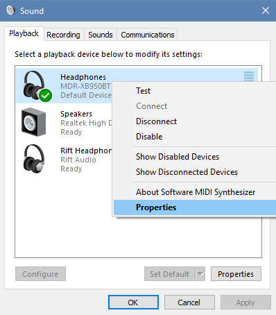

# VRAudioManager
Manages the audio devices based on user settings to better switch between audio and microphone sources when playing VR games.

<h2>What is this Application</h2>

The purpose of this program is to have simplier way to change the user's audio and microphone in the volume mixer in a few ways. The user is able to imput what their output and input prefrences are on default and on VR. The first way the user switch is by manually using the gui to choose which setting they would like: default or VR. The second way is to identify the services they would like VR to choose that start. The application can be minimized to the tray to keep it out of the way and can be manually added to start up. To learn more about how to use this program, check the usage section below.

<h2>Usage</h2>
<ol>
<li>
<h3>Adding audio and microphone devices</h3>

In order to set up the output and input devices, the correct text must be placed in the fields:
  

  
Check your input and output devices for the correct name. It should be the first row that comes up for each device in playback and recording devices menu: 
  

  If you want to rename the device, either for easy input or the fact that the name is repeated, follow these steps:
  

  
This should be the text that you need to input in the text fields.

</li>
<li>
<h3>Manual switching between devices</h3>

Manual switching is fairly easy to do.
  

</li>
<li>
<h3>Adding services to auto toggle</h3>

Service names can be used to auto toggle the audio settings when that particular service is started. To add multiple services, place each individual service on its own line. It will auto save to a text file when the app is closed. To find the service name of an application, find the name of the executable file (.exe file) and use the name excluding the extension (.exe).                      

<a href="https://msdn.microsoft.com/en-us/library/system.diagnostics.process.processname(v=vs.110).aspx">serviceName</a>

<ul>
<li>The settings will be switched to VR when any service from the list is started.</li>
<li>The setting will be switched back to default when no services from the list are open.</li>
<li>Auto toggle will only be enabled when the auto toggle checkbox is selected.</li>
</ul>

</li>
<li>
<h3>General usage</h3>
</li>
</ol>

<h2>Releases</h2>
<ul>
<li><a href="https://github.com/mbilenko03/VRAudioManager/releases">All Releases</a></li>
<li><a href="https://github.com/mbilenko03/VRAudioManager/releases/tag/v1.1.1">Version 1.1.1</a></li>
<li><a href="https://github.com/mbilenko03/VRAudioManager/releases/tag/v1.1">Version 1.1</a></li>
<li><a href="https://github.com/mbilenko03/VRAudioManager/releases/tag/v1.0">Version 1.0</a></li>

</ul>

<h2>Upcoming Features</h2>
<h4>In order of priority:</h4>
<ul>
<li>Adding ability to remember checkbox field settings</li>
<li>Option to add program to startup</li>
<li>Easy way to add services by the location of the exe file</li>
<li>Hotkeys for toggling settings</li>
</ul>

